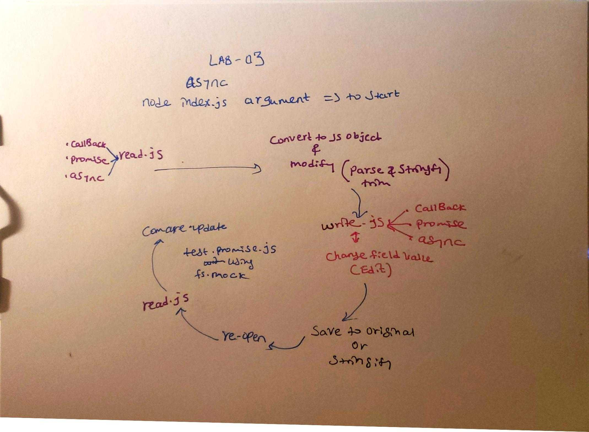

# LAB - 03

## Async

### Author: Meron

### Links and Resources
* [submission PR](https://github.com/meron-401n14/lab-03/pull/1)
* [travis](https://www.travis-ci.com/meron-401n14/lab-03)

#### Documentation
* [jsdoc] only write doc in index and each module

### Modules
#### file-promise.js; file-Async.js; files-callBack.js
##### Exported Values and Methods
 * read 
 * write

#### Running the app
* node index.js ./data/person.json

  
#### Tests
* npm test
* What assertions were made? * properly writes an object to a file,  
* properly writes a JSON string to file & fails if, given invalid JSON
* What assertions need to be / all

#### UML
* 

